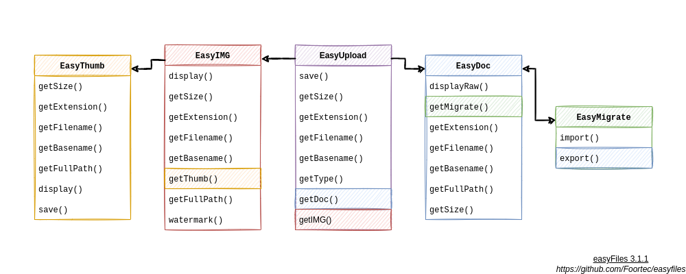

# EasyFiles
A set of classes designed to help you upload images and documents, display them, create thumbnails (from images), import / export documents to / from database. More features soon (like watermarks and more customization options).

*A quick overview*


## Requirements

 → **PHP** 8.1 (*probably should work with 8.0, but the code has only been tested with 8.1.6 version*)<br/>
 → **GD library** (*[click here](https://www.php.net/manual/en/book.image) if you have never heard of it*)<br/>
 → **MySQL** database (*for easyMigrate class to work and make sense; the code has been tested with MariaDB server type*)<br/>

## Classes and their public methods

### EasyUpload
<br/><br/>
#### __construct()
<br/>**Description**

Creates a new instance of the **EasyUpload** class.

```php
public EasyUpload::__construct(
  string $fileToUpload,
  string $savePath,
  ?string $save_as = NULL,
  int $minSize = 0,
  int $maxSize = 100000000,
  array|bool $allowedExtensions = self::DEFAULT_EXTENSIONS
)
```
<br/>**Parameters**

*fileToUpload*<br/>
A string containing name of the file input from the form.<br/><br/>

*savePath*<br/>
A string containing path to the directory where the file is supposed to be saved.<br/><br/>

*save_as*<br/>
A string containing the name (without the extension) of the file to be saved as. If NULL, the name will be "randomized".<br/><br/>

*minSize*<br/>
The minimum size of the file (in bytes).<br/><br/>

*maxSize*<br/>
The maximum size of the file (in bytes).<br/><br/>

*allowedExtensions*<br/>
An array of the allowed extension. By default it contains constant DEFAULT_EXTENSIONS array. If bool (*true* or *false*), extension will be ignored (all extensions allowed).

```php
// default allowed extensions
const DEFAULT_EXTENSIONS = array(
  "png",
  "jpg",
  "jpeg",
  "gif",
  "webp",
  "avif",
  "bmp",
  "wbmp",
  "xbm",
  "doc",
  "docx",
  "docm",
  "txt",
  "pdf",
  "htm",
  "html",
  "xml",
  "php",
  "ppt",
  "pptx",
  "json",
  "csv",
  "xls",
  "xlsx",
  "odt",
  "ods",
  "odp",
  "odg"
);
```

<br/>**Examples**<br/><br/>
Example #1: Creating instance of the easyUpload class (+ errors handling)<br/>
<br/>
*index.html*

```html
<!DOCTYPE html>
<html lang="en">
  <head>
    <meta charset="utf-8">
    <title>Example</title>
  </head>
  <body>
    <form action="upload.php" method="post" enctype="multipart/form-data">
      <input type="file" name="upload">
      <input type="submit" name="submit" value="Send">
    </form>
  </body>
</html>
```
<br/><br/>
*upload.php*

```php
<?php
if(!isset($_POST["submit"]));
  header("Location: index.html");

require "easyfiles.php";
use foortec\easyFiles\easyUpload, Throwable;

try
{
  $upload = new EasyUpload("upload", "uploaded");
  
  echo $upload->error? $upload->errorMessage : "An instance of the object created successfully.";
}
catch(Throwable $t)
{
  echo $t->getCode() . ". " . $t->getMessage();
}
```
<br/><br/>
#### save()
<br/>**Description**

Saves the file in the desired directory.

```php
public function EasyUpload::save() : bool
```
<br/>**Return values**

Returns **true** on success and **false** on failure. **False** can also mean that an error occurred in the constructor, the file is already saved or permission denied.

<br/>**Examples**<br/><br/>
Example #1: Saving the file (+ errors handling)<br/>
<br/>
*index.html*

```html
<!DOCTYPE html>
<html lang="en">
  <head>
    <meta charset="utf-8">
    <title>Example</title>
  </head>
  <body>
    <form action="upload.php" method="post" enctype="multipart/form-data">
      <input type="file" name="upload">
      <input type="submit" name="submit" value="Send">
    </form>
  </body>
</html>
```
<br/><br/>
*upload.php*

```php
<?php
if(!isset($_POST["submit"]));
  header("Location: index.html");

require "easyfiles.php";
use foortec\easyFiles\easyUpload, Throwable;

try
{
  $upload = new EasyUpload("upload", "uploaded");
  
  echo $upload->error? $upload->errorMessage : "An instance of the object created successfully.";
  echo '<br/>';
  echo $upload->save()? "Saved successfully." : "Failed to save.";
}
catch(Throwable $t)
{
  echo $t->getCode() . ". " . $t->getMessage();
}
```

<br/><br/>
#### getFullPath()
<br/>**Description**

Returns path to the saved file.

```php
public function EasyUpload::getFullPath() : string|bool
```
<br/>**Return values**

If the file is already saved (*save()* method was successfully used), a **string** containing the path to the file is returned. Otherwise a **false** is returned.

<br/><br/>
#### getIMG()
<br/>**Description**

Returns an instance of **EasyIMG** class.

```php
public function EasyUpload::getIMG() : EasyIMG|bool
```
<br/>**Return values**

If the file is already saved (*save()* method was successfully used), an *EasyIMG* **object** is returned. Otherwise a **false** is returned.

<br/><br/>
#### getDoc()
<br/>**Description**

Returns an instance of **EasyDoc** class.

```php
public function EasyUpload::getDoc() : EasyDoc|bool
```
<br/>**Return values**

If the file is already saved (*save()* method was successfully used), an *EasyDoc* **object** is returned. Otherwise a **false** is returned.

<br/><br/>
#### getType()
<br/>**Description**

Get type of the file.

```php
public function EasyUpload::getType() : string
```
<br/>**Return values**

A "img" or "doc" **string**. Based on file's MIME type. So even if the image has ex. TXT extension, the method will return "img".

<br/><br/>
#### getBasename()
<br/>**Description**

Returns basename (filename with extension) of the file.

```php
public function EasyUpload::getBasename() : string
```
<br/>**Return values**

A **string** containing the basename is returned. If the basename have not been initialized, an empty string is returned.

<br/><br/>
#### getFilename()
<br/>**Description**

Returns filename.

```php
public function EasyUpload::getFilename() : string
```
<br/>**Return values**

A **string** containing the filename is returned. If the filename have not been initialized, an empty string is returned.

<br/><br/>
#### getExtension()
<br/>**Description**

Returns extension of the file.

```php
public function EasyUpload::getExtension() : string
```
<br/>**Return values**

A **string** containing the extension is returned. If the extension have not been initialized, an empty string is returned.

<br/><br/>
#### getSize()
<br/>**Description**

Returns size of the file in bytes.

```php
public function EasyUpload::getSize() : int
```
<br/>**Return values**

An **integer** size is returned (in bytes). The file does not need to be saved (with *save()* method) to get its size.

<br/><br/>

### EasyIMG
<br/><br/>
#### __construct()
<br/>**Description**

Creates a new instance of the **EasyIMG** class.

```php
public function EasyIMG::__construct(string $path)
```
<br/>**Parameters**

*path*<br/>
A string containing path to the image.

<br/><br/>
#### display()
<br/>**Description**

Displays image using HTML  tag.

```php
public function EasyIMG::display(
  ?string $id = NULL, 
  ?string $class = NULL,
  ?string $alt = NULL
) : void
```
<br/>**Parameters**

*id*<br/>
An ID of the displayed image tag.<br/><br/>

*class*<br/>
A class of the displayed image tag.<br/><br/>

*alt*<br/>
An alt text of the displayed image tag.

<br/><br/>
#### getFullPath()
<br/>**Description**

Returns image path.

```php
public function EasyIMG::getFullPath() : string
```
<br/>**Return values**

A **string** containing the path to the file is returned.

<br/><br/>
#### getThumb()
<br/>**Description**

Returns an instance of *easyDoc* class.

```php
public function EasyIMG::getThumb(
  string $prefix = "thumb-",
  ?string $filename = null,
  string $pathThumb,
  ?int $maxDimension = 100,
  ?int $width = null,
  ?int $height = null
) : EasyThumb
```
<br/>**Parameters**

*prefix*<br/>
Prefix to the thumbnail's filename.<br/><br/>

*filename*<br/>
Thumbnail's filename. If NULL, will be the same as source image's filename.<br/><br/>

*pathThumb*<br/>
Path, where the thumbnail will be saved.<br/><br/>

*maxDimension*<br/>
Measurement of the longest dimension of an image (in pixels). The second dimension will be calculated according to aspect ratio.<br/><br/>

*width*<br/>
Thumbnail's with in pixels. It will be calculated according to aspect ratio if set to NULL (while *height* is not NULL).<br/><br/>

*height*<br/>
Thumbnail's height in pixels. It will be calculated according to aspect ratio if set to NULL (while *width* is not NULL).

<br/>**Return values**

An *EasyThumb* **object** is returned.

<br/>**Notes**

If *maxDimension* is not NULL, *width* and *height* must be set to NULL. If *maxDimension* is NULL, maximally one of the *width* and *height* can be NULL. Otherwise there will be a conflict, the constructor will not know which dimensions to use.

<br/><br/>
#### getBasename()
<br/>**Description**

Returns basename (filename with extension) of the image.

```php
public function EasyIMG::getBasename() : string
```
<br/>**Return values**

A **string** containing the basename is returned. If the basename have not been initialized, an empty string is returned.

<br/><br/>
#### getFilename()
<br/>**Description**

Returns filename.

```php
public function EasyIMG::getFilename() : string
```
<br/>**Return values**

A **string** containing the filename is returned. If the filename have not been initialized, an empty string is returned.

<br/><br/>
#### getExtension()
<br/>**Description**

Returns extension of the image.

```php
public function EasyIMG::getExtension() : string
```
<br/>**Return values**

A **string** containing the extension is returned. If the extension have not been initialized, an empty string is returned.

<br/><br/>
#### getSize()
<br/>**Description**

Returns size of the image in bytes.

```php
public function EasyIMG::getSize() : int
```
<br/>**Return values**

An **integer** size is returned (in bytes).

<br/><br/>
#### watermark()
<br/>**Description**

Adds watermark to the image.

```php
public EasyIMG::watermark(
  string $watermarkImagePath,
  string $location = "center"
) : void
```
<br/>**Parameters**

*watermarkImagePath*<br/>
A string containing path to the watermark image.<br/><br/>

*location*<br/>
A string with the watermerk's location. It is set to "center" by default.

```php
// allowed watermark locations
const WATERMARK_LOCATIONS = [
  "top",
  "top-right",
  "right",
  "bottom-right",
  "bottom",
  "bottom-left",
  "left",
  "top-left",
  "center",
  "random"
];
```

<br/>**Examples**<br/><br/>
Example #1: Adding watermark and displaying results (+ errors handling)<br/>
<br/>

```php
<?php
require "easyfiles.php";
use foortec\easyfiles\EasyIMG;

$img = new Easyimg("imgs/picture.jpg");

echo $obj->error? $obj->errorMessage : "Ok.";
echo "<br>";

$img->watermark("imgs/stamp.png", "bottom-left");

echo $obj->error? $obj->errorMessage : "Ok.";
echo "<br>";

$img->display();
```

<br/><br/>

### EasyThumb
<br/><br/>
#### __construct()
<br/>**Description**

Creates a new instance of the **EasyThumb** class.

```php
public function EasyThumb::__construct(
  string $prefix = "thumb-",
  ?string $filename = null,
  string $pathThumb,
  string $pathIMG,
  ?int $maxDimension = 100,
  ?int $width = null,
  ?int $height = null
)
```
<br/>**Parameters**

*prefix*<br/>
Thumbnail filename prefix.<br/><br/>

*filename*<br/>
Thumbnail filename. If leaved NULL, the filename will be the same as the target image's filename.<br/><br/>

*pathThumb*<br/>
Path, where the thumbnail will be saved.<br/><br/>

*pathIMG*<br/>
Path to the image.<br/><br/>

*maxDimension*<br/>
Measurement of the longest dimension of an image (in pixels). The second dimension will be calculated according to aspect ratio.<br/><br/>

*width*<br/>
Thumbnail's with in pixels. It will be calculated according to aspect ratio if set to NULL (while *height* is not NULL).<br/><br/>

*height*<br/>
Thumbnail's height in pixels. It will be calculated according to aspect ratio if set to NULL (while *width* is not NULL).

<br/>**Notes**

If *maxDimension* is not NULL, *width* and *height* must be set to NULL. If *maxDimension* is NULL, maximally one of the *width* and *height* can be NULL. Otherwise there will be a conflict, the constructor will not know which dimensions to use.

<br/><br/>
#### getFullPath()
<br/>**Description**

Returns thumbnail path.

```php
public function EasyThumb::getFullPath() : string
```
<br/>**Return values**

A **string** containing the path to the thumbnail is returned.

<br/><br/>
#### display()
<br/>**Description**

Displays thumbnail using HTML  tag.

```php
public function EasyThumb::display(
  ?string $id=NULL,
  ?string $class=NULL,
  ?string $alt=NULL
) : void
```
<br/>**Parameters**

*id*<br/>
An ID of the displayed image tag.<br/><br/>

*class*<br/>
A class of the displayed image tag.<br/><br/>

*alt*<br/>
An alt text of the displayed image tag.

<br/>**Notes**

The thumbnail does not need to be saved to be displayed.

<br/><br/>
#### save()
<br/>**Description**

Saves thumbnail.

```php
public function EasyThumb::save(?string $extension = null) : bool
```
<br/>**Parameters**

*extension*<br/>
Output thumbnail extension.<br/><br/>

<br/>**Return values**

Returns **true** on success and **false** on failure. **False** can also mean that the thumbnail is not created (an error occurred in the constructor) or permission denied.

<br/><br/>
#### getBasename()
<br/>**Description**

Returns basename (filename with extension) of the thumbnail.

```php
public function EasyThumb::getBasename() : string
```
<br/>**Return values**

A **string** containing the basename is returned.

<br/><br/>
#### getFilename()
<br/>**Description**

Returns filename.

```php
public function EasyThumb::getFilename() : string
```
<br/>**Return values**

A **string** containing the filename is returned.

<br/><br/>
#### getExtension()
<br/>**Description**

Returns extension of the thumbnail.

```php
public function EasyThumb::getExtension() : string
```
<br/>**Return values**

A **string** containing the extension is returned.

<br/><br/>
#### getSize()
<br/>**Description**

Returns size of the saved thumbnail in bytes.

```php
public function EasyThumb::getSize() : int|bool
```
<br/>**Return values**

An **integer** size is returned (in bytes). Returns **false** if the thumbnail has not been saved (*save()* method).

<br/><br/>
#### __destruct()
<br/>**Description**

Destructs a **EasyThumb** class object.

```php
public function EasyThumb::__destruct()
```

<br/><br/>

### EasyDoc
<br/><br/>
#### __construct()
<br/>**Description**

Creates a new instance of the **EasyDoc** class.

```php
public function EasyDoc::__construct(string $path)
```
<br/>**Parameters**

*path*<br/>
Path to the document.

<br/><br/>
#### displayRaw()
<br/>**Description**

Displays unformatted content of the file.<br/>
If nothing is display, it is propably because of an error or the file is empty.

```php
public function EasyDoc::displayRaw() : void
```

<br/><br/>
#### getMigrate()
<br/>**Description**

Returns an instance of **EasyMigrate** class.

```php
public function EasyDoc::getMigrate(
  string $tableName,
  string $hostname = MYSQLI_HOSTNAME,
  string $username = MYSQLI_USERNAME,
  string $password = MYSQLI_PASSWORD,
  string $database = MYSQLI_DATABASE,
  string $port = MYSQLI_PORT,
  string $socket = MYSQLI_SOCKET
) : EasyMigrate
```
<br/>**Parameters**

*tableName*<br/>
The name of the table that will be created and into which the data from the file will be inserted.<br/><br/>

*hostname*<br/>
The hostname for database connection. By default it is set to the constant named *MYSQLI_HOSTNAME*.<br/><br/>

*username*<br/>
The username for database connection. By default it is set to the constant named *MYSQLI_USERNAME*.<br/><br/>

*password*<br/>
The password for database connection. By default it is set to the constant named *MYSQLI_PASSWORD*.<br/><br/>

*database*<br/>
The database name for database connection. By default it is set to the constant named *MYSQLI_DATABASE*.<br/><br/>

*port*<br/>
The port for database connection. By default it is set to the constant named *MYSQLI_PORT*.<br/><br/>

*socket*<br/>
The socket for database connection. By default it is set to the constant named *MYSQLI_SOCKET*.<br/>

*The MYSQLI database connection constants*
```php
define("MYSQLI_HOSTNAME", "localhost");
define("MYSQLI_USERNAME", "root");
define("MYSQLI_PASSWORD", "");
define("MYSQLI_DATABASE", "easyfilesdb");
define("MYSQLI_PORT", ini_get("mysqli.default_port"));
define("MYSQLI_SOCKET", ini_get("mysqli.default_socket"));
```

<br/>**Return values**

An *easyMigrate* **object** is returned.

<br/>**Notes**

The object created via *getMigrate()* method can only be used to import the file to the database, because right now there is no possibility of appending files. So if you want to export the file, you should use *easyMigrate::__construct()* method.

<br/><br/>
#### getFullPath()
<br/>**Description**

Returns document path.

```php
public function EasyDoc::getFullPath() : string
```
<br/>**Return values**

A **string** containing the path to the document is returned.

<br/><br/>
#### getBasename()
<br/>**Description**

Returns basename (filename with extension) of the file.

```php
public function EasyDoc::getBasename() : string
```
<br/>**Return values**

A **string** containing the basename is returned.

<br/><br/>
#### getFilename()
<br/>**Description**

Returns filename.

```php
public function EasyDoc::getFilename() : string
```
<br/>**Return values**

A **string** containing the filename is returned.

<br/><br/>
#### getExtension()
<br/>**Description**

Returns extension of the file.

```php
public function EasyDoc::getExtension() : string
```
<br/>**Return values**

A **string** containing the extension is returned.

<br/><br/>
#### getSize()
<br/>**Description**

Returns size of the file in bytes.

```php
public function EasyDoc::getSize() : int
```
<br/>**Return values**

An **integer** size is returned (in bytes).

<br/><br/>

### EasyMigrate
<br/><br/>
#### __construct()
<br/>**Description**

Creates a new instance of **EasyMigrate** class.

```php
public function EasyMigrate::__construct(
  string $path,
  string $tableName,
  string $hostname = MYSQLI_HOSTNAME,
  string $username = MYSQLI_USERNAME,
  string $password = MYSQLI_PASSWORD,
  string $database = MYSQLI_DATABASE,
  string $port = MYSQLI_PORT,
  string $socket = MYSQLI_SOCKET
)
```
<br/>**Parameters**

*path*<br/>
The path to the file for import or to the folder where the exported file will be created.<br/><br/>

*tableName*<br/>
The name of the exisiting (for export) or not existing (for import) table.<br/><br/>

*hostname*<br/>
The hostname for database connection. By default it is set to the constant named *MYSQLI_HOSTNAME*.<br/><br/>

*username*<br/>
The username for database connection. By default it is set to the constant named *MYSQLI_USERNAME*.<br/><br/>

*password*<br/>
The password for database connection. By default it is set to the constant named *MYSQLI_PASSWORD*.<br/><br/>

*database*<br/>
The database name for database connection. By default it is set to the constant named *MYSQLI_DATABASE*.<br/><br/>

*port*<br/>
The port for database connection. By default it is set to the constant named *MYSQLI_PORT*.<br/><br/>

*socket*<br/>
The socket for database connection. By default it is set to the constant named *MYSQLI_SOCKET*.<br/>

*The MYSQLI database connection constants*
```php
define("MYSQLI_HOSTNAME", "localhost");
define("MYSQLI_USERNAME", "root");
define("MYSQLI_PASSWORD", "");
define("MYSQLI_DATABASE", "easyfilesdb");
define("MYSQLI_PORT", ini_get("mysqli.default_port"));
define("MYSQLI_SOCKET", ini_get("mysqli.default_socket"));
```

<br/>**Notes**

The *path* and the *tableName* arguments define what is possible to do: import or export. If *path* will lead to a directory and the *tableName* will be a name of a existing table, only export will be possible. If *path* will lead to a file and the *tableName* will be a name of a non-exisiting table, only import will be possible. In other cases an error will occur.

<br/><br/>
#### import()
<br/>**Description**

Imports the document to the database.

```php
public function EasyMigrate::import(string $delimiter = ",") : void
```
<br/>**Parameters**

*delimiter*<br/>
A sign separating bits of data in the file. The *import()* method may use it or not. Ex. if the file will have an XML extension, the *delimiter* will not be used.

<br/>**Notes**

If import is not possible (see **Notes** for *EasyMigrate::__construct()*) an error will occur.

<br/><br/>
#### export()
<br/>**Description**

Exports the document from the database.

```php
public function EasyMigrate::export(
  ?string $filename = null,
  string $extension = "txt",
  string $delimiter = ","
) : EasyDoc|bool
```
<br/>**Parameters**

*filename*<br/>
Output file name. If set to NULL, the filename will be the same as database table name.<br/><br/>

*extension*<br/>
Output file extension.<br/><br/>

*delimiter*<br/>
A sign separating bits of data in the file. The *export()* method may use it or not. Ex. if the *extension* will be set to XML, the *delimiter* will not be used.

<br/>**Return values**

An *easyDoc* **object** is returned on success, **false** on failure or if an error occurred in the constructor. 

<br/>**Notes**

If export is not possible (see **Notes** for *EasyMigrate::__construct()*) an error will occur.<br/><br/>
A name of the exported file will be the same as table name.

<br/><br/>

## Errors
<br/><br/>

### Build-in errors

Every class has it's own public properties used to errors handling.

```php
public bool $error = false;
public ?string $errorMessage = NULL;
```

The data is always validated when creating an instance of the class. If something is not correct, the value of the *error* property is changed to **true** and the error message is inserted into the *errorMessage* property.<br/>
Therefore, it is recommended to check the *error* property after creating a new object.<br/>

<br/>Example #1: Checking for an error after creating a new object.<br/>
*The code does not fully work, it is only an example.*

```php
use foortec\easyFiles\easyUpload;

$object = new easyUpload(/* args */);

echo $object->error? $object->errorMessage : "Everything's fine!";
```

<br/><br/>

### Exceptions

Some methods throw Exceptions. This is mainly for database-connecting methods (*easyMigrate* class).<br/>
